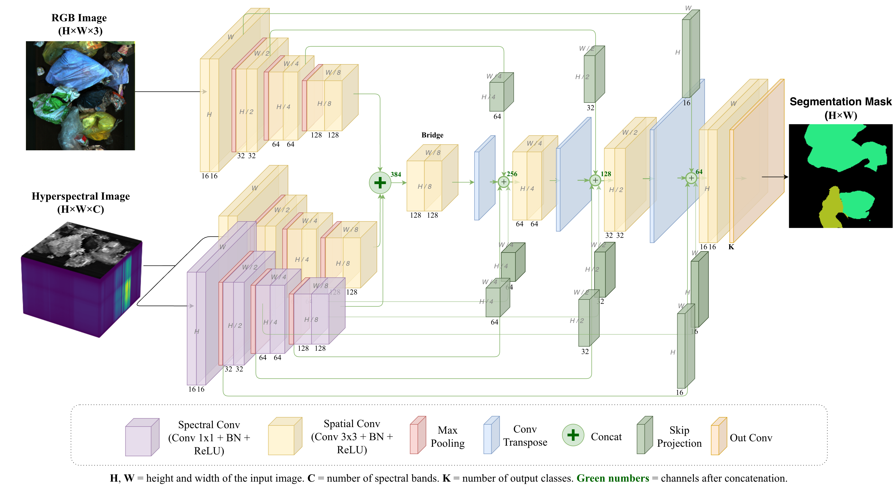

# HyFuse-UNet: A Lightweight Hyperspectral-RGB Fusion Network for Waste Semantic Segmentation in Edge-Based Recycling Systems

<p align="center">
  <a href="mailto:dac-hieu.nguyen@univ-lille.fr">Dac Hieu Nguyen</a><sup>*</sup> -
  <a href="mailto:ludovic.koehl@ensait.fr">Ludovic Koehl</a> -
  <a href="mailto:guillaume.tartare@ensait.fr">Guillaume Tartare</a> -
  <a href="mailto:kim-phuc.tran@ensait.fr">Kim Phuc Tran</a>
</p>

<p align="center">
  University of Lille, ENSAIT, ULR 2461 - GEMTEX–Laboratoire de Génie et Matériaux Textiles, F-59000 Lille, France
  <br>
  International Chair in DS &amp; XAI, International Research Institute for Artificial Intelligence and Digital Transformation, Dong A University, Da Nang, Viet Nam
  <br>
  <sup>*</sup>Corresponding author
</p>

<p align="center">
  <a href="https://www.sciencedirect.com/science/article/pii/S0950705126018113"></a>
  <a href="https://doi.org/10.1016/j.knosys.2026.117085"></a>
</p>

A lightweight network for semantic segmentation of waste using RGB and hyperspectral images (HSI) and deployable on an FPGA-based edge device.

<p align=center>

</p>


The code is adapted from the original [SpectralWaste segmentation repository](https://github.com/ferpb/spectralwaste-segmentation), with modifications. We thank the SpectralWaste authors for releasing their code and data.

## 1. Installation

From the repository root:

```bash
python3.10 -m venv .venv
source .venv/bin/activate
pip install --upgrade pip
pip install -e .
```

## 2. Datasets

### SpectralWaste

Download the preprocessed, labeled dataset released by the original authors:

- [Preprocessed dataset on Zenodo](https://zenodo.org/records/10880544) — approximately 23 GB.
- [Original dataset repository](https://github.com/ferpb/spectralwaste-dataset).
- [SpectralWaste project page](https://sites.google.com/unizar.es/spectralwaste).

Extract it under `data/spectralwaste_segmentation/`, then generate PCA-32 inputs as described in Section 3.

### OpenTextile-Recycle

OpenTextile-Recycle is the simulated textile recycling dataset introduced in our paper, derived from [OpenTextile-NIR](https://zenodo.org/records/18269172). The command-line dataset name is `opentextile`.

[**Dataset download link**](https://1drv.ms/u/c/3ffb4076c488cc93/IQCinwE_UiPXQbMOV5fgyGepAf8JcIQWR41HZze5WcIZgXI?e=sdRhNb)  — approximately 22 GB.

Extract it under `data/opentextile/`.

## 3. Generate PCA-32 inputs

The dataset itself does not contain `hyper_pca32/`; this step reduces the original hyperspectral images to 32 PCA channels.

### SpectralWaste

```bash
python scripts/dim_reduction.py \
  --data-path data/spectralwaste_segmentation/hyper \
  --reduction-method pca \
  --num-components 32
```

### OpenTextile-Recycle

```bash
python scripts/dim_reduction.py \
  --data-path data/opentextile/hyper \
  --reduction-method pca \
  --num-components 32
```

## 4. Train HyFuse-UNet

### SpectralWaste

```bash
python scripts/train_model.py \
  --dataset spectralwaste \
  --data-path data/spectralwaste_segmentation \
  --results-path results/spectralwaste \
  --model hyfuseunet \
  --input-mode rgb,hyper_pca32 \
  --batch-size 12 \
  --max-epoch 200
```

### OpenTextile-Recycle

```bash
python scripts/train_model.py \
  --dataset opentextile \
  --data-path data/opentextile \
  --results-path results/opentextile \
  --model hyfuseunet \
  --input-mode rgb,hyper_pca32 \
  --batch-size 12 \
  --max-epoch 200
```

Other models are registered in [`segmentation/models/__init__.py`](segmentation/models/__init__.py), including U-Net, MiniNet-v2, SegFormer-B0, CMX-B0, CSFNet, MMSFormer-B0, and CMNeXt-B0.

## 5. Evaluation

Replace the example checkpoint paths below with your trained `.best.pth` checkpoint.

### SpectralWaste

```bash
python scripts/train_model.py \
  --dataset spectralwaste \
  --data-path data/spectralwaste_segmentation \
  --model hyfuseunet \
  --input-mode rgb,hyper_pca32 \
  --resume /path/to/spectralwaste_checkpoint.pth \
  --test-only
```

### OpenTextile-Recycle

```bash
python scripts/train_model.py \
  --dataset opentextile \
  --data-path data/opentextile \
  --model hyfuseunet \
  --input-mode rgb,hyper_pca32 \
  --resume /path/to/opentextile_checkpoint.pth \
  --test-only
```

## 6. Quantization and FPGA deployment on AMD VCK190

The paper uses **Vitis AI 3.0** on the **AMD VCK190** platform. Follow the official **[Vitis AI 3.0 VCK190 Quick Start Guide](https://xilinx.github.io/Vitis-AI/3.0/html/docs/quickstart/vck190.html)**. Use a Vitis AI 3.0 environment and matching board image when reproducing the paper.

### Downloads

The following three downloads will be provided to reproduce the results:

- [**Quantization code (PTQ, FFT, and QAT)**](https://1drv.ms/u/c/3ffb4076c488cc93/IQBHQypod6WMTKAXb1WWBryvAR56YaL40vaNpohqCSvcG3g?e=3dkWCz)
- [**Quantization results (PTQ, FFT, and QAT)**](https://1drv.ms/u/c/3ffb4076c488cc93/IQC7bT_DjQjfTbq4jho_ci2uAUajrbibGG7oWmFAaEGnxK8?e=Z0WFY0)
- [**Checkpoint for SpectralWaste and OpenTextile-Recycle**](https://1drv.ms/f/c/3ffb4076c488cc93/IgCdu-s3MyVqQ6lsa-0FLBlJAQ_AU6KPec3WtPclgQR6R_Y?e=5zzpEj)
- [**PCA-32 data for SpectralWaste**](https://1drv.ms/u/c/3ffb4076c488cc93/IQBxKvvLqiI1Sq7fT1O9r94NAUbc3KvyANvYOXV6jaKlvvs?e=q5pRYb)
- [**PCA-32 data for Opentextile-Recycle**](https://1drv.ms/u/c/3ffb4076c488cc93/IQBh1GJ4D1W4TLql0iyJZWEkATFp_p_gMBHn0wcPoPmZ-jE?e=Y9kidQ)

PTQ stands for Post-Training Quantization, FFT for Fast Fine-tuning, and QAT for Quantization-Aware Training. Use the checkpoint and PCA-32 data associated with the same dataset to reproduce the results.

### Prepare the files inside Docker

Extract the code archive into any working directory inside the Vitis AI Docker container. Extraction creates a folder named `hyfuseunet/`. Place `data/` alongside `hyfuseunet/`, at the same directory level, and put the downloaded checkpoints inside `hyfuseunet/checkpoints/`.

For example, using `/workspace/` as the working directory and `checkpoints/` to hold the checkpoint files:

```text
/workspace/
├── hyfuseunet/
│   ├── README.md
│   ├── quantize.py
│   ├── checkpoints/
│   │   └── ...
│   └── ...
└── data/
    ├── spectralwaste_segmentation/
    │   ├── hyper_pca32
    │   └── ...
    └── opentextile/
        ├── hyper_pca32
        └── ...
```

## 7. Citation and acknowledgments

If you use this work, please cite:

```bibtex
@article{NGUYEN2026117085,
  title = {HyFuse-UNet: A lightweight hyperspectral-RGB fusion network for waste semantic segmentation in edge-based recycling systems},
  journal = {Knowledge-Based Systems},
  volume = {352},
  pages = {117085},
  year = {2026},
  issn = {0950-7051},
  doi = {https://doi.org/10.1016/j.knosys.2026.117085},
  url = {https://www.sciencedirect.com/science/article/pii/S0950705126018113},
  author = {Dac Hieu Nguyen and Ludovic Koehl and Guillaume Tartare and Kim Phuc Tran},
  keywords = {Waste segmentation, Multimodal learning, RGB-HSI fusion, Semantic segmentation, FPGA deployment},
}
```